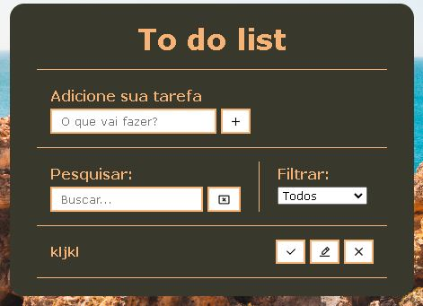

<h1 align="center"> To Do List Avançado </h1>

Projeto em JavaScript com a utilização da local storage para persistir os dados armazenados em JSON.  

  <a href="#rocket-tecnologia">Tecnologias</a>&nbsp;&nbsp;&nbsp;|&nbsp;&nbsp;&nbsp;
  <a href="#computer-projeto---acesse-aqui">Projeto</a>&nbsp;&nbsp;&nbsp;|&nbsp;&nbsp;&nbsp;
  <a href="#memo-licença">Licença</a>

  

 

  

## :rocket: Tecnologia

Esse projeto foi desenvolvido com as seguintes tecnologias:

- HTML
- CSS
- JavaScript

## :computer: Projeto - [Acesse aqui](https://allanpt.github.io/To_do_List_advanced)

Esse projeto tem por conceito aplicar os conhecimentos estudados pela plataforma de ensino Udemy Academy.

## :memo: [Licença](LICENSE)

Esse projeto está sob a licença MIT.